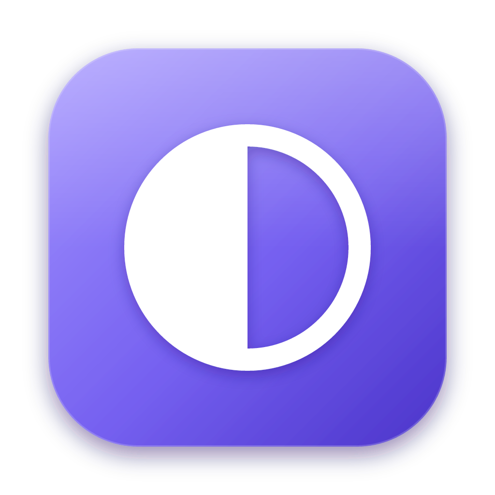

<p align="center">
  
</p>

<h1 align="center">Ollama Studio</h1>

<p align="center">
  A desktop app for chatting with local models through <a href="https://ollama.com">Ollama</a>, with a layout inspired by LM Studio.
</p>

---

## Features

**Chat**
- Streaming responses with Markdown, tables, and syntax-highlighted code blocks
- Collapsible "thought process" for reasoning models (Qwen3, DeepSeek-R1, gpt-oss, …)
- Tokens/sec, token count, and time-to-first-token for every reply
- Edit & resend, regenerate, branch a chat from any message, delete messages
- Image attachments for vision models (drag & drop or paste)
- Per-chat system prompt; chats are saved locally

**Models**
- Model picker (<kbd>⌘L</kbd>) that loads the model into memory, with capability badges (vision, tools, reasoning)
- *My Models*: see what's loaded and how much VRAM it uses, load/eject/delete, and inspect architecture, template, and modelfile
- Sampling controls: temperature, top-k, top-p, min-p, repeat penalty, context length, max tokens, seed, keep-alive

**Downloads**
- Pull anything from the [Ollama library](https://ollama.com/library)
- Search **Hugging Face** for GGUF models and pick a quantization. It's pulled as `hf.co/<repo>:<quant>`
- Pause, resume, and retry downloads, with speed and time remaining; unfinished downloads survive restarts

**Everywhere**
- Right-click menus for chats, messages, code blocks, models, and downloads
- Keyboard shortcuts: <kbd>⌘N</kbd> new chat, <kbd>⌘L</kbd> model picker, <kbd>Enter</kbd> send, <kbd>Shift</kbd>+<kbd>Enter</kbd> newline

## Requirements

- [Ollama](https://ollama.com/download) installed and running (`ollama serve`)
- [Node.js](https://nodejs.org) 22 or newer
- macOS (Apple Silicon) is the tested platform. The app is Electron, so Windows and Linux should work in dev mode.

## Getting started

```bash
git clone https://github.com/ejsoler/ollama-studio.git
cd ollama-studio
npm install
npm run app
```

### Install as a Mac app

```bash
npm run install-app
```

This builds `Ollama Studio.app`, signs it for local use, and copies it to `/Applications`. Run it again after you pull updates.

### All scripts

| Command | What it does |
| --- | --- |
| `npm run app` | Desktop app with hot reload (Electron + Vite) |
| `npm run dev` | Browser-only version at http://localhost:5173 |
| `npm run build` | Type-check and build the web assets to `dist/` |
| `npm start` | Build, then run in Electron without hot reload |
| `npm run dist` | Package `Ollama Studio.app` into `release/` |
| `npm run install-app` | Package and copy to `/Applications` |
| `npm run icons` | Regenerate icons from `build/icon.svg` |

## Configuration

By default the app talks to Ollama at `http://127.0.0.1:11434`. You can change this in **Developer → Server URL**, for example to use Ollama on another machine. That server must allow the app's origin:

```bash
OLLAMA_HOST=0.0.0.0 OLLAMA_ORIGINS=* ollama serve
```

## Project structure

```
electron/         Electron main process and dev launcher
src/
  api.ts          Ollama REST client (streaming chat, pull, show, ps…)
  hf.ts           Hugging Face Hub search + GGUF quant listing
  downloads.ts    Download queue with pause/resume
  store.ts        Persistent state and Ollama polling
  components/     Model picker, Markdown renderer, context menu, icons
  views/          Chat, My Models, Discover, Hugging Face, Developer
build/            App icon source, icon generator, install script
```

## Privacy

Everything runs locally. The app talks only to your Ollama server, plus the Hugging Face API when you browse the Hugging Face tab. Chats and settings are stored in the app's local storage on your machine.

## License

[MIT](LICENSE)

*Ollama Studio is an independent project. It is not affiliated with or endorsed by Ollama or LM Studio.*
